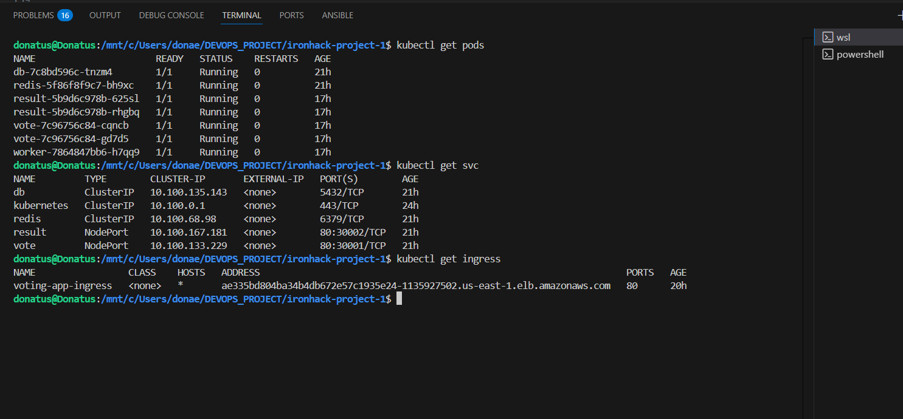

## Voting App on Amazon EKS - DevOps Project

This repository contains my DevOps project where I deployed a 3-tier web application (Vote app, Result app, Worker, Redis, PostgreSQL) on Amazon EKS (Elastic Kubernetes Service). The goal of this project is to showcase my skills as a junior DevOps engineer by applying industry practices: Infrastructure as Code, Docker, Kubernetes, CI/CD, and AWS. It reflects how I approach real-world DevOps challenges, step by step, learning by doing, and implementing best practices.

## 🎯 Project Objectives

✅ Build and containerize microservices (Vote app, Result app, Worker, Redis, PostgreSQL).

✅ Push Docker images to Docker Hub.

✅ Provision and deploy to Amazon EKS cluster.

✅ Implement NGINX Ingress Controller for routing external traffic.

✅ Automate builds and deployments with GitHub Actions CI/CD pipeline.

✅ Showcase Kubernetes manifests (Deployments, Services, Ingress, ConfigMaps).

**So I built a voting app where people can vote for cats 🐱 or dogs 🐕 and see real-time results!**

## 🏗️ Architecture:

### Frontend → NGINX Ingress → Amazon EKS → Microservices

The application follows a 3-tier design:

1. Frontend:

       ## - vote → Python Flask app (voting UI).

       ## - result → Node.js app (displays results).

2. Backend:

       ## - worker → .NET service that processes votes.

3. Database Layer:

       ## - redis → stores votes temporarily (in-memory).

       ## - postgresql → stores results permanently.

**All components are containerized with Docker, deployed on Kubernetes, and routed externally using NGINX Ingress.**

## 🛠️ Tech Stack

- AWS EKS – Kubernetes orchestration

- Terraform – Infrastructure provisioning (VPC, subnets, cluster)

- Docker – Containerization of apps

- GitHub Actions – CI/CD pipeline

- NGINX Ingress Controller – Traffic routing

- PostgreSQL & Redis – Data layer.

## ⚡ How to Run This Project

Follow these steps to set up and run the project:

1. Clone the Repository
     - git clone   https://github.com/donaemeka/3-tier-app-on-amazon-eks-cluster.git
     - cd          3-tier-app-on-amazon-eks-cluster

2. Create EKS Cluster with eksctl

**eksctl create cluster --name dona-eks --region us-east-1 --nodegroup-name worker-nodes --node-type t3.medium --nodes 2 --nodes-min 2 --nodes-max 4 --managed**

## This creates:

- VPC (with public/private subnets)

- NAT & Internet Gateways

- Security Groups

- Amazon EKS Cluster

3.  Verify the cluster:    
    - kubectl get nodes

4. Build & Push Docker Images:
**Each microservice has a Dockerfile. Build and push them to Docker Hub:**
   - docker build -t <dockerhub-username>/voting-app-vote ./vote
   - docker push <dockerhub-username>/voting-app-vote

        **(Repeat for result, worker, etc.)**

5. Deploy Kubernetes Manifests
   Inside the k8s/ folder:
      - kubectl apply -f .
      - kubectl get pods

5. Install NGINX Ingress Controller
   - kubectl apply -f https://raw.githubusercontent.com/kubernetes/ingress-nginx/main/deploy/static/provider/aws/deploy.yaml

6. Access the Application
   Get the external IP of the ingress:
   - kubectl get ingress

Open Vote App → http://<EXTERNAL-IP>/vote
 Open Result App → http://<EXTERNAL-IP>/result

## 📸 Screenshots:

## Kubernetes Overview
This screenshot shows the running pods, services, and ingress with the external IP.

## Vote App UI

## Result App UI

## 📚 Lessons Learned

1. How to provision an EKS cluster using eksctl.

2. Writing Kubernetes manifests for both stateless and stateful apps.

3. Using NodePort vs Ingress to expose services.

4. Debugging CrashLoopBackOff by fixing missing environment variables.

5. Understanding logs with kubectl logs to troubleshoot apps.

6. Importance of labels & selectors for service discovery.

7. Integrating CI/CD pipeline with GitHub Actions for automated builds & deploys.

## 🐞 Errors I Resolved

1. **CrashLoopBackOff in Vote App**

    - Cause: Missing REDIS_HOST and REDIS_PORT environment variables.

    - Fix: Updated vote-deployment.yaml with env variables.

2. **503 NGINX Service Temporarily Unavailable**

    - Cause: Ingress deployed before backend services were ready.

    - Fix: Waited for pods to be Running before testing ingress.

3. **GitHub Actions workflow not triggering**

    - Cause: Workflow YAML was in wrong folder (.github/ci-cd-pipeline.yml).

    - Fix: Moved it to .github/workflows/ci-cd-pipeline.yml.

## 🚀 Future Enhancements

1. Add Prometheus + Grafana for monitoring.

2. Use Helm charts for deployment.

3. Implement autoscaling.

## 🙋 About Me

I am **Donatus Emeka Anyalebechi**, a Junior DevOps Engineer passionate about building and automating infrastructure.  
This project is part of my learning journey where I:  

- Built and deployed a **3-Tier Application** on **Amazon EKS**  
- Containerized services with **Docker**  
- Automated deployment with **GitHub Actions CI/CD**  
- Debugged and solved real-world Kubernetes issues  

## I am actively looking for a **Junior DevOps Engineer role** where I can apply my skills in **Kubernetes, CI/CD, Cloud, and Infrastructure as Code**.  

📫 Reach me at:  
- Email: **donaemeka92@gmail.com**  
- GitHub: [donaemeka](https://github.com/donaemeka)  
- LinkedIn: [Donatus DevOps](https://www.linkedin.com/in/donatus-devops)  

